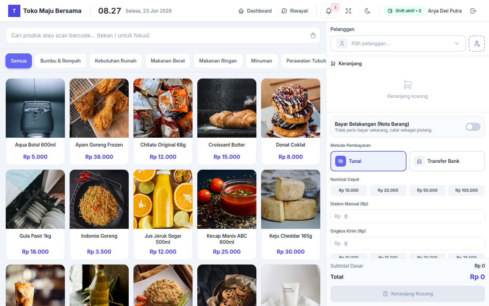
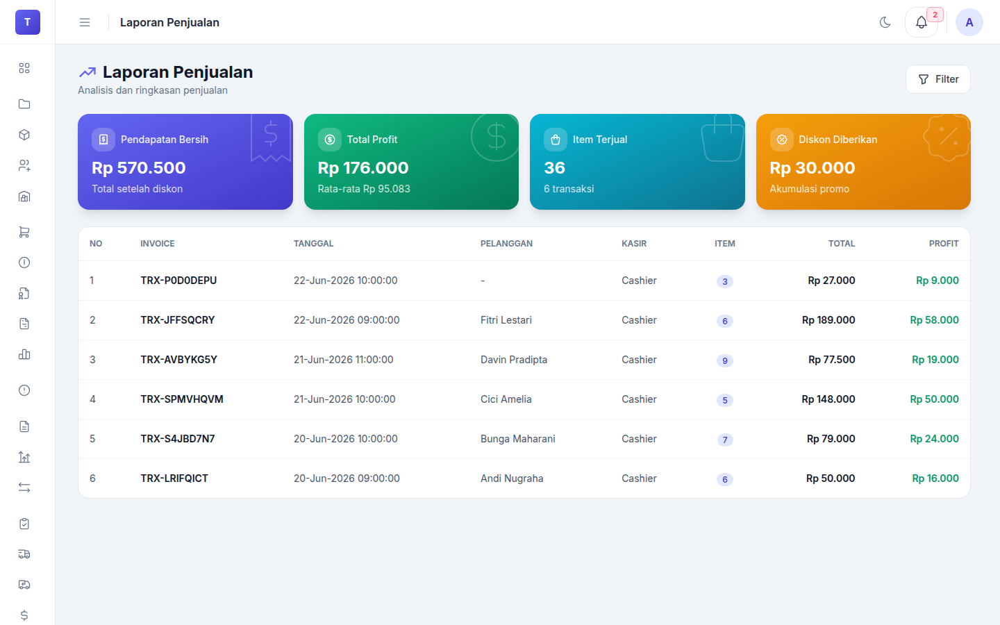
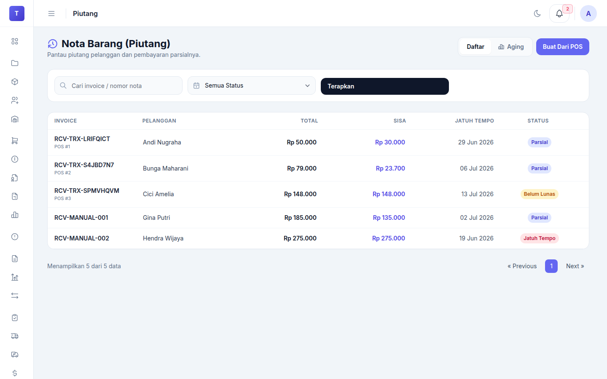

# Point of Sales

Laravel + Inertia + React pointst-of-sale system for sales transactions, inventory audit, purchasing, finance, CRM, loyalty, and operational observability, with multi-warehouse, tax, and offline-mode support.

> 200+ GitHub stars • Open-source • MIT License

---

## Cuplikan Layar

| POS Checkout | Dashboard | Stock Opname |
|:---:|:---:|:---:|
|  |  |  |
| **Sales Report** | **Receivables** | **Multi-Warehouse** |
|  |  |  |

📸 **[View the full gallery (33 screenshots)](docs/screenshots.md)**

---

## Features Main

### POS & Transactions
- Product search by barcode / keyword
- Barcode scanner via camera (PWA)
- Cart multi-item with hold/resume
- Multi-method checkout: cash, bank transfer, Midtrans, Xendit, pay later
- Multi-unit products (pcs, box, kg, carton) with automatic stock conversion
- Multi-price list: different prices per customer group
- Promo engine: discount, qty break, bundle, buy-x-get-y
- Diskon with approval workflow
- PPN 11% (exclusive/inclusive)
- Thermal printer support (WebUSB)
- Offline mode (queue transactions saat offline, sync saat online)

### Inventory & Multi-Warehouse
- Product, category, and barcode management
- Separate stock per warehouse/branch
- Stock transfers between warehouses (draft → send → receive)
- Stock opname per warehouse
- Stock mutation history
- Batch/expiry date tracking (FEFO)
- Composite products / kits
- Reorder pointst + auto-PO suggestion
- Low stock notification

### Purchasing
- Purchase Order (draft → ordered → partial → completed)
- Goods Receiving (with input batch)
- Supplier Returns
- Payables (supplier payables) with aging

### Finance
- Receivables (customer receivables) with partial payment
- Aging analysis + collection notes
- PPN/PPh tax management
- Customer portal: view invoices and pay receivables online

### CRM & Loyalty
- Customer management + wilayah Indonesia
- Member tiers (regular, silver, gold, platinum)
- Points loyalty (earn/redeem)
- Voucher customer
- Customer segments (manual & auto)
- Campaign automation (reminder, promo broadcast)
- **WhatsApp Gateway** — kirim pesan otomatis via whatsapp-web.js (QR scan, session persistent)

### Reports & Documents
- Sales report + filter + summary
- Profit report + margin analysis
- Advanced sales insights (hourly, cashier performancence, repeat customer)
- PDF invoice, receipt (80mm/58mm), shipping label
- PDF receivable/payable
- Export to Excel (products, customer, transactions)

### Admin
- Full RBAC (users, roles, permissions)
- Audit log (before/after snapshot)
- Import products and customers from Excel
- **App Versioning** — centralized application version (`APP_VERSION`), tampil in sidebar + POS navbar

### Integrasi
- **WhatsApp Gateway** — connected via Node.js service (`whatsapp-service/`)
- **Payment Gateways** — Midtrans, Xendit

---

## Quick Start

```bash
git clone https://github.com/aryadwiputra/pointst-of-sales.git
cd pointst-of-sales
cp .env.example .env
composer install && npm install
php artisan key:generate
php artisan migrate --seed
php artisan storage:link

# Dev servers — run all in separate terminals
npm run dev          # Vite HMR
php artisan serve    # Laravel

# WhatsApp Gateway (optional) — for automatic WhatsApp sending
cd whatsapp-service
npm install && npm start
```

## Default Login

- Admin: `arya@gmail.com` / `password`
- Cashier: `cashier@gmail.com` / `password`

## Detailed Documentation

| Document | Contents |
|---------|-----|
| `docs/getting-started.md` | Complete setup |
| `docs/configuration.md` | Environment, payment, tax, printer, and WhatsApp configuration |
| `docs/architecture-overview.md` | Arsitektur, middleware, service layer, Node service |
| `docs/feature-index.md` | Index of all modules (44 feature) |

## REST API (OpenAPI)

Dikasir provides a REST API for mobile app and third-party integrations. Automatic interactive documentation (Scramble) available at:

- **UI docs:** `/docs/api` — try endpoints directly from the browser (Try It)
- **OpenAPI spec:** `/docs/api.json` — for generating clients (Postman, OpenAPI Generator, Swagger Codegen)

All endpoints (except `auth/login`, `auth/register`, webhooks) require **Bearer token**:

```bash
# 1. Login → get a token
curl -X POST https://dicashier.web.id/api/v1/auth/login \
  -H "Content-Type: application/json" \
  -d '{"email":"admin@example.com","password":"password"}'
# → {"token": "1|abc123...", "user": {...}}

# 2. Panggil API with token
curl https://dicashier.web.id/api/v1/products \
  -H "Authorization: Bearer 1|abc123..."
```

**Available modules** (`/api/v1/`):

| Modul | Endpointst | Notes |
|-------|----------|------------|
| Auth | `auth/login`, `auth/logout`, `auth/me`, `auth/register` | Token-based (Sanctum) |
| Product | `products` | CRUD + search + categories |
| Customers | `customers` | CRUD + loyalty member |
| Categories | `categories` | CRUD |
| Warehouses | `warehouses` | CRUD (multi-warehouse) |
| Supplier | `suppliers` | CRUD |
| POS | `pos/shift`, `pos/products`, `pos/cart`, `pos/hold`, `pos/checkout`, `pos/transactions` | Complete cashier flow (mobile) |

Base URL: `https://dicashier.web.id/api/v1` (dev: `http://localhost:8000/api/v1`)

### Per Modul

- POS & Transactions, Sales Return, Cashier Shift
- Inventory: products, stock counts, mutations, warehouse, stock transfer, batch, composite
- Purchasing: PO, goods receiving, supplier return, payables
- Finance: receivables, PPN
- Pricing: pricing rules, price list, loyalty, vouchers
- CRM: member, segments, campaigns, **WhatsApp Gateway**
- Reports: sales, profit, insights, PDF documents
- Tools: import/export, mobile POS, thermal printer, offline mode

## Troubleshooting Umum

1. **Permission cache stale after seeding** — logout lalu login lagi
2. **Webhook Midtrans/Xendit does not work** — make sure `APP_URL` public, not `localhost`
3. **Product images do not appear** — run `php artisan storage:link`
4. **Route error 500** — run `php artisan migrate` for new modules
5. **Tests fail because of tax** — make sure `tax_rate=0` in test Product::create
6. **Vite does not run** — make sure `npm run dev` berjalan, jangan hanya `php artisan serve`
7. **WhatsApp QR does not appear** — make sure `whatsapp-service/` is already running (`npm start`)
8. **WhatsApp disconnected** — klik "Reconnect" in Settings > WhatsApp, scan again QR

## Kontribusi

1. Branch from `development`: `git checkout -b feature/name-feature development`
2. Create a PR to `development`
3. PR to `main` only from `development` via branching release

Make sure `php artisan test` passes before PR.

## Lisensi

MIT License
